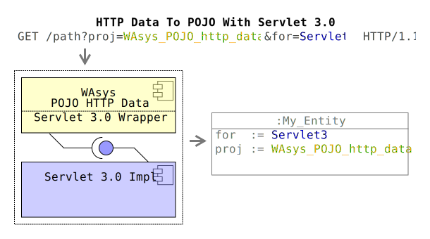
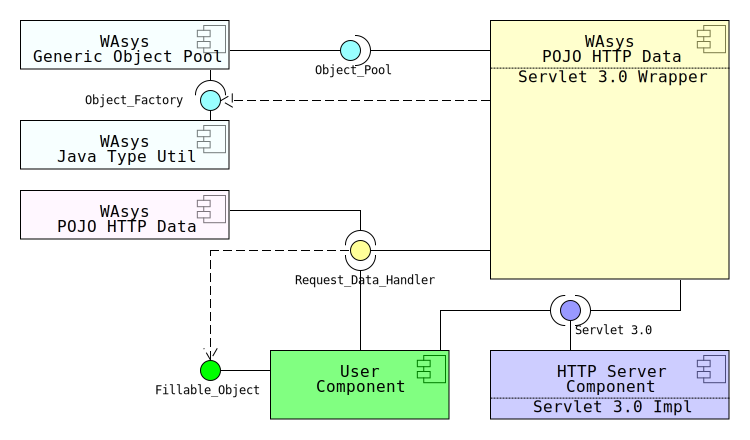
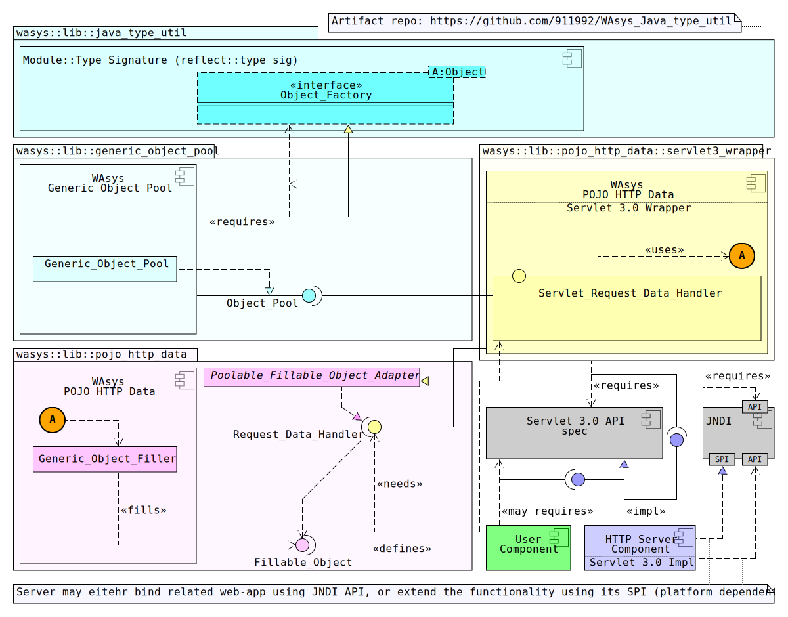
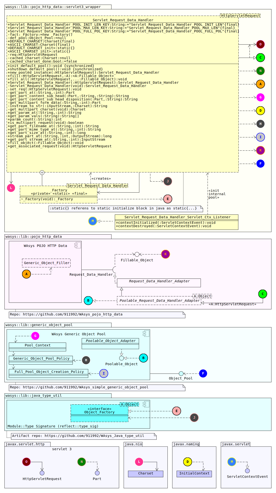

# WAsys_pojo_http_data_servlet3_wrapper
Servlet 3.0 wrapper for [WAsys_pojo_http_data](https://github.com/911992/WAsys_pojo_http_data) lib

  
*Diagram 0: Repo Social Media Img*  

## Revision History
Latest: v0.3.5 (Sept 1, 2020)  
Please refer to [release_note.md](./release_note.md) file  

## Requirements
0. A HTTP server that supports **Servlet 3.0** (e.g. Apache Tomcat, Jetty, etc..)
1. [WAsys_pojo_http_data](https://github.com/911992/WAsys_pojo_http_data) Library
2. [WAsys_Java_type_util](https://github.com/911992/WAsys_Java_type_util) Library
3. [WAsys_simple_generic_object_pool](https://github.com/911992/WAsys_simple_generic_object_pool) Library

## Who is Supposed To Use It?
If you wish to perform some "HTTP Parameter to POJO" in *Servlet* level env, so this lib may help.

### Sample Usage
Please check [WAsys_pojo_http_data_servlet3_wrapper_test](https://github.com/911992/WAsys_pojo_http_data_servlet3_wrapper_test) repo that contains some sample usage about utilizing the lib.

## Overview
This library is a *wrapper*, between a concreted **Servlet 3.0** Engine, and required **HTTP Server Component** module in WAsys_pojo_http_data lib.  

It simply implements(completes) the support for HTTP to POJO for Servlet 3.0 API.  

Considering following abstracted composition diagram, that gives a fast vision of related componenets, and this lib.  

  
*Diagram 1: [Abstract Composite Structure Diagram](./_docs/diagram/abstract_composite_struct_diagram.svg)*  

## Maven Repository
This lib now is available from central maven repository(thanks sonatype, and apache)  

Add following dependency to your `pom.xml` maven conf file
```xml
<dependency>
    <groupId>com.github.911992</groupId>
    <artifactId>WAsys_pojo_http_data_servlet3_wrapper</artifactId>
    <version>0.3.5</version>
</dependency>
```

Not a maven project? Not a problem this lib could be build using ant too.  
Besides that artifacts could be grabed from central maven repository.

## Composition Structure
Considering the more detailed composite structure diagram.  

  
*Diagram 2: [Composite Structure Diagram](./_docs/diagram/composite_struct_diagram.svg)*  

### Explination
**Overview:** **Servlet 3.0 Wrapper** component, implements `Request_Data_Handler`, which is a requirement for **POJO HTTP Data** module. **User Component** Asks initialize/utilize the **Servlet 3.0 Wrapper**(`Servlet_Request_Data_Handler`) to ask its `Fillable_Object`s filled.

#### HTTP Server Component
This refers to the engine that implements the **Servlet 3.0(JEE) API** spec, this could be Apache Tomcat or whatever as far as implements the *Servlet 3.0* API correctly.

#### JNDI
This componenet is used for getting some config about internal/default `Object_Pool` initialization that **Servlet 3.0 Wrapper** may requires, such as pool initialize size, max and full policy. *(please refer to repo [WAsys_simple_generic_object_pool](https://github.com/911992/WAsys_simple_generic_object_pool) for more detailed info)*

#### User Component
The componenet where end-user/dev sits, as user defines its POJOs(`Fillable_Object`s), and asks this lib to its POJOs get filled.

Please mind that **User Component** should not be run on a JEE/Servlet enviroment essentially, where for instance assuming a serverless(higher-level) of business, that depends on a **WAsys_pojo_http_data** for good.

*Note: for missed componenet explination, please refer to [WAsys_pojo_http_data](https://github.com/911992/WAsys_pojo_http_data) repo*

## Class Diagram
  
*Diagram 3: [Class Diagram](./_docs/diagram/class_diagram.svg)*  

### `Servlet_Request_Data_Handler`
The type that implements `Poolable_Request_Data_Handler_Adapter`(which is an addapter of type `Request_Data_Handler`).

This type is a `Poolable_Object` too, and has a builtin private-dedicated `Object_Factory`, and a reference to an `Object_Pool` instance as home/pool of the type.

## Filling Method
Filling is done by default POJO filler `Generic_Object_Filler` which is part of [WAsys_pojo_http_data](https://github.com/911992/WAsys_pojo_http_data) dependent project.

The actual method `fill_object(:Fillable_Object):void` has a default definition from in parent type `Request_Data_Handler_Adapter` as calls the default filler object, and this method is not overriden by `Servlet_Request_Data_Handler`/this-repo.

Please refer to [WAsys_pojo_http_data](https://github.com/911992/WAsys_pojo_http_data) for more detailed info about POJO filling policy.

## Utilizing The Lib
Class `Servlet_Request_Data_Handler` could be grabbed as a standalone-classic instance using `new`, or from its internal pool, as a `Poolable_Object` instance, that is a `AutoClosable` too, and could be used in a `try-with-resource` block.

### Getting A `Servlet_Request_Data_Handler`
Considerring following ways are provided for utilizing `Servlet_Request_Data_Handler`

#### A Pooled(`Poolable_Object`) Instance Using `new_pooled_instance()`
Static method `new_pooled_instance` returns a pooled instance from the internal `Object_Pool` instance. This method may throws a `NullPointerException` when the internal pool has not been initialized yet by calling `init_default_pool()` method.

##### Step 0: Initializing The Internal Pool
Calling `init_default_pool()` *once* is **required** in order to initializing the internal `Object_Pool` for `Servlet_Request_Data_Handler` type.

One recommendation is using the default `ServletContextListener` implemented type `Servlet_Request_Data_Handler_Servlet_Ctx_Listener`, by referencing it as a servlet context listener int web descriptor file(`web.xml`).  
```xml
<listener>
    <listener-class>wasys.lib.pojo_http_data.servlet3_wrapper.Servlet_Request_Data_Handler_Servlet_Ctx_Listener</listener-class>
</listener>
```

Class `Servlet_Request_Data_Handler_Servlet_Ctx_Listener` simply calls static  `init_default_pool()`, and `shutdown_default_pool()` methods from type `Servlet_Request_Data_Handler`, when servlet context is about init or destroy state. So those methods would be called somewhere else as user.

##### Step 1: Grab A `Poolable_Object`
Using static method `new_pooled_instance(:HttpServletRequest):Servlet_Request_Data_Handler` that first it asks the intarnal `Object_Pool` for a `Servlet_Request_Data_Handler` instance, and then sets the given servlet request object to it.

As mentioned `Servlet_Request_Data_Handler` is a `AutoClosable` too, so this is recommended to use by a `try-with-resources` block, considering following example.  

```java
HttpServletRequest _serv_req;//
//...
My_Fillable_Entity _ent = new My_Fillable_Entity();
try(Servlet_Request_Data_Handler _srdh = Servlet_Request_Data_Handler.new_pooled_instance(_serv_req)){
//Using the _srdh
_srdh.fill(_ent);

}//_srdh will be closed(back-to-pool) automatically
```

**Note:** make sure any *pooled* `Servlet_Request_Data_Handler` instance is taken from `new_pooled_instance()` method will be closed(no matter using a `try-with-resource`, or manually by calling the `close()`), or inconsistency will be for your env.

#### Standalone (Non-Pooled) Instance
In this way, simply using the `public` constructor that takes the related servlet request entry, and it's done. Considerring following example.

```java
HttpServletRequest _serv_req;//
//...
My_Fillable_Entity _ent = new My_Fillable_Entity();
Servlet_Request_Data_Handler _srdh = new Servlet_Request_Data_Handler(_serv_req);
//Using the _srdh
_srdh.fill(_ent);
//no need for closing _srdh
```

### Fast And Easy `Filalble_Object` Filling Using Static `fill()`/`fill_all()` Methods
**`fill(:HttpServletRequest,:A):<A:Fillable_Object>`**  

Static method `fill()` grabs an instance from internal pool, and attempts to fill the given `Fillable_Object` using `HttpServletRequest` arg.

This is a very fast and safe way, since it closes the grabbed pooled `Servlet_Request_Data_Handler` once the fill is finished.

**Note:** the internal pool *MUST* be initialized before any call to `fill()` is appreciated, or there will be some `NullPointerExceptions`

The return type is always the same input `A:Fillable_Object` argument for `fill() method`. Actually this method is supposed to be `void`. The reason it returns the same input arg is make it easier use of `try-with-resources` where the given `A:Fillable_Object` is a `AutoClosable` too(such as `Poolable_Object`)

Considering following example

```java
HttpServletRequest _serv_req;//
//...
My_Fillable_Entity0 _ent0 = new My_Fillable_Entity0();
Servlet_Request_Data_Handler.fill(_serv_req,_ent0);
//OR maybe something like
try(My_Fillable_Entity1 _ent1 = Servlet_Request_Data_Handler.fill(_serv_req,new My_Fillable_Entity1());){

}//closing the _ent1
```

**`fill_all(:HttpServletRequest,...:Fillable_Object):void`**  

Unlike the `fill()` method, this method is a `void`, and it tries to fill up all given `Fillable_Object`s with associated `HttpServletRequest`. Please mind just like `fill()` method, the internal pool *MUST* be already initialized in order to call this method.

Considering following example  

```java
HttpServletRequest _serv_req;//
//...
My_Fillable_Entity0 _ent0 = new My_Fillable_Entity0();
My_Fillable_Entity1 _ent1 = new My_Fillable_Entity1();
My_Fillable_Entity2 _ent2 = new My_Fillable_Entity2();
Servlet_Request_Data_Handler.fill_all(_serv_req,_ent0,_ent1,_ent2);
```


## `Servlet_Request_Data_Handler` Internal Pool Initializing
Internal pool initializing for type `Servlet_Request_Data_Handler` is done by calling the static `init_default_pool()` method, which as mentioned, it's better to be called by a servlet context listener (as default `Servlet_Request_Data_Handler_Servlet_Ctx_Listener` to be added to web descriptor `web.xml` file).

During the initialization, `Servlet_Request_Data_Handler` asks the *JNDI* to grab some env parameters are requried for initializing the internal pool, these values as explained as following list

0. A `String` value with key `Servlet_Request_Data_Handler_POOL_INIT_LEN`, that holds the pool initial value.
1. A `String` value with key `Servlet_Request_Data_Handler_POOL_MAX_LEN`, that holds the pool maximum allowed holding instances.
2. A `String` value with key `Servlet_Request_Data_Handler_POOL_FULL_POL`, that points out to a const of `Full_Pool_Object_Creation_Policy` enum (case-sensitive).

**Note:** any *invalid* or *missed* value will causing using defined values/state from `Generic_Object_Pool_Policy.DEF_INS`.  

Here is one way to customizing/providing a non-default data for internal pool policy data, using web descriptor `web.xml`

```xml
<web-app ...>
...
<env-entry>
    <env-entry-name>Servlet_Request_Data_Handler_POOL_INIT_LEN</env-entry-name>
    <env-entry-type>java.lang.String</env-entry-type>
    <!-- -1 to specify using the default pool value, probably 0 -->
    <env-entry-value>-1</env-entry-value>
</env-entry>
<env-entry>
    <env-entry-name>Servlet_Request_Data_Handler_POOL_MAX_LEN</env-entry-name>
    <env-entry-type>java.lang.String</env-entry-type>
    <env-entry-value>32</env-entry-value>
</env-entry>
<env-entry>
    <env-entry-name>Servlet_Request_Data_Handler_POOL_FULL_POL</env-entry-name>
    <env-entry-type>java.lang.String</env-entry-type>
    <!-- values should be one of wasys.lib.generic_object_pool.Full_Pool_Object_Creation_Policy enum consts -->
    <env-entry-value>Create_New_No_Pooling</env-entry-value>
</env-entry>
...
</web-app>    
```

**HINT:** This is highly recommended to sync the value of `Servlet_Request_Data_Handler_POOL_MAX_LEN` with server's HTTP connection pool config, for maximum performance, and minimum incosnsitency.

## Throubleshooting
**T0: Calling `Servlet_Request_Data_Handler.init_default_pool()` prints some exception on `STDOUT`**  
Possibilities:  

* Invalid integer values for `Servlet_Request_Data_Handler_POOL_INIT_LEN` or `Servlet_Request_Data_Handler_POOL_MAX_LEN` JNDI keys
* Invalid value for `Servlet_Request_Data_Handler_POOL_FULL_POL` key, which is supposed to be one of the const of `Full_Pool_Object_Creation_Policy` enum type
* Invalid values for `Servlet_Request_Data_Handler_POOL_INIT_LEN` or `Servlet_Request_Data_Handler_POOL_MAX_LEN` that violets creation of a `Generic_Object_Pool_Policy` (e.g. max is less than init size)

**T1: Calling static `Servlet_Request_Data_Handler.fill()` or ``Servlet_Request_Data_Handler.fill_all()`` method throws `NullPointerException`**  
This is probably because non-initialized internal pool yet, make sure internal pool has been initialized(only once) using `init_default_pool()` method

**T2: Calling static `Servlet_Request_Data_Handler.new_pooled_instance()` method throws `NullPointerException`**  
Same as *T1* above, make sure internal pool is initialized

**T3: Thread lock on calling `Servlet_Request_Data_Handler.new_pooled_instance()` or `Servlet_Request_Data_Handler.fill()`**  
One reason could be becasue of the internal pool, that has initialized with `Full_Pool_Object_Creation_Policy.Wait_Till_One_Free`, and there is no any pooled instance ready to be provide, eitehr because of a bad conf for initialization, or previously instances by `Servlet_Request_Data_Handler.new_pooled_instance()` are still in used, or has been forgotten to get free.

**T4: `IllegalStateException` for filling a `Fillable_Object`**  
This is probably because of a streamable field in related POJO(`Fillable_Object`). Make sure your `HttpServlet` has annotated with `MultipartConfig`

## TODOs
- [ ] Wrapper for *pre* Servlet 3.0 spec (*maybe*, just maybe, using Apache Commons for `multipart` processing)